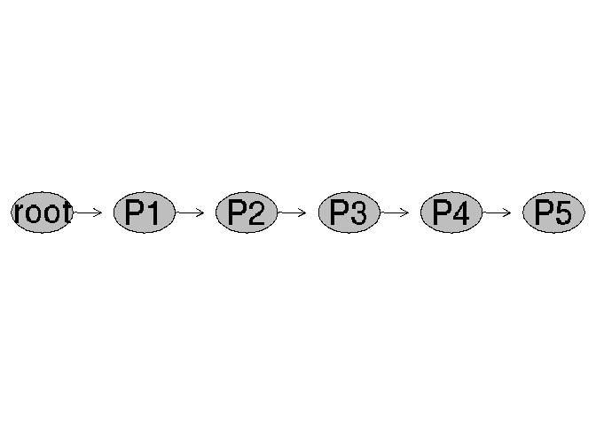
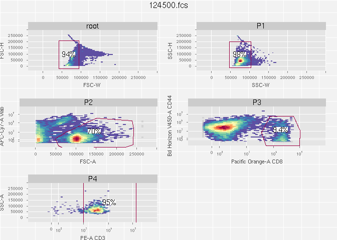

# 

# CytoML: Cross-Platform Cytometry Data Sharing.

This package is designed to import/export the hierarchical gated
cytometry data to and from R (specifically the
[openCyto](https://github.com/RGLab/openCyto) framework) using the
[`gatingML2.0`](https://www.ncbi.nlm.nih.gov/pmc/articles/PMC4874733/)
and [`FCS3.0`](http://isac-net.org/Resources/Standards/FCS3-1.aspx)
cytometry data standards. This package makes use of the `GatingSet` R
object and data model so that imported data can easily be manipulated
and visualized in R using tools like
[openCyto](https://github.com/RGLab/openCyto) and
[ggCyto](https://github.com/RGLab/ggcyto).

## What problems does CytoML solve?

CytoML allows you to:

  - Import manually gated data into R from
    [Diva](http://www.bdbiosciences.com/us/instruments/clinical/software/flow-cytometry-acquisition/bd-facsdiva-software/m/333333/overview),
    [FlowJo](https://www.flowjo.com/) and
    [Cytobank](https://cytobank.org/).
  - Combine manual gating strategies with automated gating strategies in
    R.
  - Export data gated manually, auto-gated, or gated using a combination
    of manual and automated strategies from R to
    [Diva](http://www.bdbiosciences.com/us/instruments/clinical/software/flow-cytometry-acquisition/bd-facsdiva-software/m/333333/overview),
    [FlowJo](https://www.flowjo.com/) and
    [Cytobank](https://cytobank.org/).
  - Share computational flow analyses with users on other platforms.
  - Perform comparative analyses between computational and manual gating
    approaches.
    
### Reporting Bugs or Issues
- Use the issue template in github when creating a new issue. 
- Follow the instructions in the template (do your background reading).
- Search and verify that the issue hasn't already been addressed.
- Check the Bioconductor support site. 
- Make sure your flow packages are up to date.
- THEN if your issue persists, file a bug report.

Otherwise, we may close your issue without responding.


## INSTALLATION

CytoML can be installed in several ways:

### For all versions:

For all versions, you must have dependencies installed

``` r
library(BiocManager)
# This should pull all dependencies.
BiocManager::install("openCyto") 

# Then install latest dependencies from github, using devtools.
install.packages("devtools") 
library(devtools) #load it

install_github("RGLab/flowWorkspace", ref="trunk")
install_github("RGLab/openCyto", ref="trunk")
```

### Installing from [BioConductor](https://www.bioconductor.org).

  - [Current BioConductor
    Relase](https://doi.org/doi:10.18129/B9.bioc.CytoML)

<!-- end list -->

``` r
library(BiocManager)
#this should pull all dependencies.
BiocManager::install("CytoML", version = "devel") 
```

  - [Current BioConductor Development
    Version](http://bioconductor.org/packages/devel/bioc/html/CytoML.html)

<!-- end list -->

``` r
library(BiocManager)
#this should pull all dependencies.
BiocManager::install("CytoML", version = "devel") 
```

### Installing from GitHub

  - [Latest GitHub Version](https://github.com/RGLab/CytoML)

<!-- end list -->

``` r
install.packges("devtools")
devtools::install_github("RGLab/CytoML", ref = "trunk")
```

  - [Latest GitHub Release](https://github.com/RGLab/CytoML/releases)

<!-- end list -->

``` r
install.packges("devtools")
devtools::install_github("RGLab/CytoML@*release")
```

## Reproducible examples from the CytoML paper

  - A reproducible workflow can be found at the [RGLab
    site](http://www.rglab.org/CytoML), and was prepared with version
    1.7.10 of CytoML, R v3.5.0, and dependencies that can be installed
    by:

<!-- end list -->

``` r
# We recomend using R version 3.5.0
devtools::install_github("RGLab/RProtoBufLib@v1.3.7")
devtools::install_github("RGLab/cytolib@v1.3.2")
devtools::install_github("RGLab/flowCore@v1.47.7")
devtools::install_github("RGLab/flowWorkspace@v3.29.7")
devtools::install_github("RGLab/openCyto@v1.19.2")
devtools::install_github("RGLab/CytoML@v1.7.10")
devtools::install_github("RGLab/ggcyto@v1.9.12")
```

## Examples

### Import data

To import data you need the xml workspace and the raw FCS files.

#### Import `gatingML` generated from [Cytobank](https://cytobank.org/).

``` r
library(CytoML)
acsfile <- system.file("extdata/cytobank_experiment.acs", package = "CytoML")
ce <- open_cytobank_experiment(acsfile)
xmlfile <- ce$gatingML
fcsFiles <- list.files(ce$fcsdir, full.names = TRUE)
gs <- cytobank_to_gatingset(xmlfile, fcsFiles)
```

#### Import a [Diva](http://www.bdbiosciences.com/us/instruments/clinical/software/flow-cytometry-acquisition/bd-facsdiva-software/m/333333/overview) workspace.

``` r
ws <- open_diva_xml(system.file('extdata/diva/PE_2.xml', package = "flowWorkspaceData"))
# The path to the FCS files is stored in ws@path.
# It can also be passed in to parseWorksapce via the `path` argument.
gs <- diva_to_gatingset(ws, name = 2, subset = 1, swap_cols = FALSE)
```

#### Interact with the gated data (`GatingSet`)

We need `flowWorkspace` to interact with the imported data.

``` r
library(flowWorkspace)
```

We can visualize the gating tree as follows:

``` r
#get the first sample
gh <- gs[[1]]

#plot the hierarchy tree
plot(gh)
```

<!-- -->

For more information see the
[flowWorkspace](http://www.github.com/RGLab/flowWorkspace) package.

We can print all the cell populations defined in the gating tree.

``` r
#show all the cell populations(/nodes)
gs_get_pop_paths(gh)
```

    ## [1] "root"            "/P1"             "/P1/P2"          "/P1/P2/P3"      
    ## [5] "/P1/P2/P3/P4"    "/P1/P2/P3/P4/P5"

We can extract the cell population statistics.

``` r
#show the population statistics
gh_pop_compare_stats(gh)
```

    ##    openCyto.freq   xml.freq openCyto.count xml.count node
    ## 1:    1.00000000 1.00000000          19090     19090 root
    ## 2:    0.93609219 0.93776847          17870     17902   P1
    ## 3:    0.97991046 0.97994637          17511     17543   P2
    ## 4:    0.70327223 0.70307245          12315     12334   P3
    ## 5:    0.09378806 0.09404897           1155      1160   P4
    ## 6:    0.95151515 0.94827586           1099      1100   P5

The `openCyto.count` column shows the cell counts computed via the
import. The `xml.count` column shows the cell counts computed by FlowJo
(note not all platforms report cell counts in the workspace). It is
normal for these to differ by a few cells due to numerical differences
in the implementation of data transformations. CytoML and openCyto are
*reproducing* the data analysis from the raw data based on the
information in the workspace.

We can plot all the gates defined in the workspace.

``` r
#plot the gates
plotGate(gh) 
```

<!-- -->

#### Access information about cells in a specific population.

Because CytoML and flowWorkspace reproduce the entire analysis in a
workspace in R, we have access to information about which cells are part
of which cell popualtions.

flowWorkspace has convenience methods to extract the cells from specific
cell populations:

``` r
gh_pop_get_data(gh,"P3")
```

    ## flowFrame object '9a1897d7-ebc9-4077-aa34-6d9e1367fa67'
    ## with 12315 cells and 15 observables:
    ##                   name desc  range  minRange maxRange
    ## $P1               Time <NA> 262144 0.0000000 262144.0
    ## $P2              FSC-A <NA> 262144 0.0000000 262144.0
    ## $P3              FSC-H <NA> 262144 0.0000000 262144.0
    ## $P4              FSC-W <NA> 262144 0.0000000 262144.0
    ## $P5              SSC-A <NA> 262144 0.0000000 262144.0
    ## $P6              SSC-H <NA> 262144 0.0000000 262144.0
    ## $P7              SSC-W <NA> 262144 0.0000000 262144.0
    ## $P8             FITC-A <NA> 262144 0.1516347      4.5
    ## $P9               PE-A  CD3 262144 0.2953046      4.5
    ## $P10     PerCP-Cy5-5-A <NA> 262144 0.4697134      4.5
    ## $P11          PE-Cy7-A <NA> 262144 0.5638024      4.5
    ## $P12             APC-A  bob 262144 0.7838544      4.5
    ## $P13         APC-Cy7-A Viab 262144 0.6886181      4.5
    ## $P14 Bd Horizon V450-A CD44 262144 0.6413334      4.5
    ## $P15  Pacific Orange-A  CD8 262144 0.3376040      4.5
    ## 231 keywords are stored in the 'description' slot

This returns a `flowFrame` with the cells in gate P3 (70% of the cells
according to the plot).

The matrix of expression can be extracted from a `flowFrame` using the
`exprs()` method from the `flowCore` package:

``` r
library(flowCore)
e <- exprs(gh_pop_get_data(gh,"P3"))
class(e)
```

    ## [1] "matrix"

``` r
dim(e)
```

    ## [1] 12315    15

``` r
colnames(e)
```

    ##  [1] "Time"              "FSC-A"             "FSC-H"            
    ##  [4] "FSC-W"             "SSC-A"             "SSC-H"            
    ##  [7] "SSC-W"             "FITC-A"            "PE-A"             
    ## [10] "PerCP-Cy5-5-A"     "PE-Cy7-A"          "APC-A"            
    ## [13] "APC-Cy7-A"         "Bd Horizon V450-A" "Pacific Orange-A"

``` r
#compute the MFI of the fluorescence channels.
colMeans(e[,8:15])
```

    ##            FITC-A              PE-A     PerCP-Cy5-5-A          PE-Cy7-A 
    ##         0.8305630         1.3162132         0.7743459         0.8017827 
    ##             APC-A         APC-Cy7-A Bd Horizon V450-A  Pacific Orange-A 
    ##         1.0482663         1.1636818         2.2960554         1.3684453

### Export gated data to other platforms.

In order to export gated data, it must be in `GatingSet`
format.

#### Export a `GatingSet` from R to [Cytobank](https://cytobank.org/) or [FlowJo](https://www.flowjo.com/)

Load something to export.

``` r
dataDir <- system.file("extdata",package="flowWorkspaceData")
gs <- load_gs(list.files(dataDir, pattern = "gs_manual",full = TRUE))
```

    ## loading R object...

    ## loading tree object...

    ## Done

##### Export to Cytobank

``` r
#Cytobank
outFile <- tempfile(fileext = ".xml")
gatingset_to_cytobank(gs, outFile)
```

    ## Warning in gatingset_to_cytobank(gs, outFile): With
    ## 'cytobank.default.scale' set to 'TRUE', data and gates will be re-
    ## transformed with cytobank's default scaling settings, which may affect how
    ## gates look like.

    ## [1] "/tmp/RtmpV1ZasG/file4b9f7e4e25c1.xml"

##### Export to FlowJo

``` r
#flowJo
outFile <- tempfile(fileext = ".wsp")
gatingset_to_flowjo(gs, outFile)
```

    ## [1] "/tmp/RtmpV1ZasG/file4b9f18da0869.wsp"

## Next Steps

See the [flowWorskspace](http://www.github.com/RGLab/flowWorkspace) and
\[openCyto\](<http://www.github.com/RGLab/openCyto>\] packages to learn
more about what can be done with `GatingSet` objects.

## Code of conduct

Please note that this project is released with a [Contributor Code of
Conduct](CODE_OF_CONDUCT.md). By participating in this project you agree
to abide by its terms.
