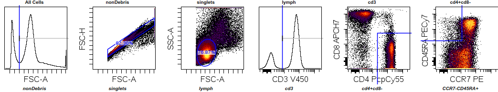
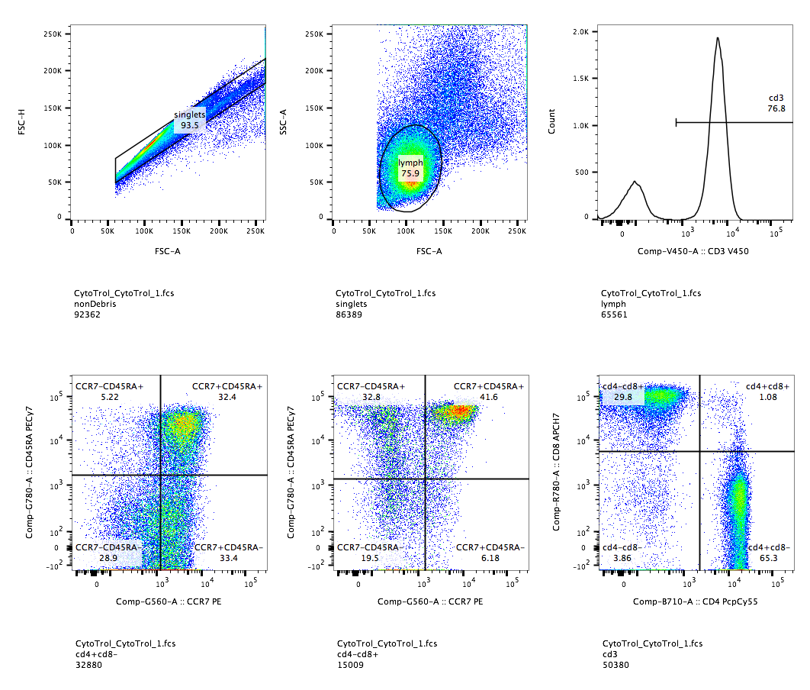

```{r setup, include=FALSE}
knitr::opts_chunk$set(echo = TRUE, results = "markup", message = FALSE, warning = FALSE)
```

A `GatingSet` object can be exported as a GatingML file or GatingML-based wsp flowJo workspace (version 10) so that they can be loaded into `Cytobank` or `flowJo`.

The `GatingSet` to be exported can be either parsed from `Cytobank` or `flowJo` or created by automated gating 
algorithms from `openCtyo`. Here we will demontrate the latter.

## Automated gating
### Load raw FCS files into GatingSet
```{r}
library(ncdfFlow)
library(flowWorkspace)
library(CytoML)
dataDir <- system.file("extdata",package="flowWorkspaceData")
#load raw FCS
fs <- load_cytoset_from_fcs(file.path(dataDir,"CytoTrol_CytoTrol_1.fcs"))
gs <- GatingSet(fs)
```

### Compensate and transform
```{r}
#compensate
comp <- spillover(fs[[1]])[["SPILL"]]
chnls <- colnames(comp)
comp <- compensation(comp)
gs <- compensate(gs, comp)

#transform
trans <- flowjo_biexp_trans()
trans <- transformerList(chnls, trans)
gs <- transform(gs, trans)
```
Note that the compensation and transformation **must** be applied directly to `GatingSet` instead of `flowSet/ncdfFlowSet` so that these information will be stored in the `GatingSet` object and exported to gatingML eventually.

### Load the gating template and run auto gating
```{r warning=FALSE}
library(openCyto)
#load the original template for tcell panel
tbl <- data.table::fread(system.file("extdata/gating_template/tcell.csv", package = "openCyto"))
#modify some paramters to fit the current data range
tbl[5, gating_args:= "gate_range = c(1e3, 3e3)"]
tbl[c(8,11), gating_args:= "gate_range = c(2e3, 3e3)"]
#write the new template to disc
gtFile <- tempfile()
write.csv(tbl, file = gtFile)
##reload the new template
gt <- gatingTemplate(gtFile, autostart = 1L)
#run the gating
gating(gt, gs)
#hide the gates that are not of interest
toggle.helperGates(gt, gs)
#visualize the gates
library(ggcyto)
autoplot(gs[[1]])
```

## Export to Cytobank 
```{r}
outFile <- tempfile(fileext = ".xml")
gatingset_to_cytobank(gs, outFile)
```
Note that the resulted `xml` file is a standard `GatingML2.0` file with some additional `custom_info` added so that it can be recognized by `Cytobank`. Here is the example gate plot from `Cytobank` after the gatingML is imported.



## Export to FlowJo 
```{r eval=FALSE}
outFile <- tempfile(fileext = ".wsp")
gatingset_to_flowjo(gs, outFile)
```
The resutled `wsp` file is a `XML`-based `flowJo` workspace and can be loaded into `flowJo`(V10) along with orginal FCS files.Here is the gate plots from `flowJo` after it is imported.



